# LetterLens UK — AI + Android OCR 📬


**LetterLens** scans official UK letters and transforms them into **plain-English explanations** with **GOV.UK citations** and a **next-steps checklist**.  
It demonstrates how **AI + Mobile** can simplify government communication for everyday people.

⚠️ *Disclaimer: This is not legal advice. No images are uploaded; only OCR text is processed via API.*

---

## 🎥 Demo
- 🎬 [YouTube Demo](https://www.youtube.com/shorts/lvZbWHVL1h4)  
- 📱 [APK Release](https://github.com/Qandil11/LetterLens/releases)  
- 📖 [Medium Article](https://medium.com/@qandil.tariq11/letterlens-turning-uk-letters-into-what-when-what-next-kotlin-compose-ml-kit-ktor-kmp-e6ed06695f8b)  
- 💬 [Dev.to Blog](https://dev.to/qandil_tariq_0e73fd980d58/build-an-ocr-action-pipeline-with-kotlin-ml-kit-android-ktor-server-kmp-roadmap-5efc)  

---

## 🚀 Why LetterLens?
Official UK letters (e.g., tax, benefits, NHS) are often **complex and confusing**.  
LetterLens was built to:  
- Extract text with **on-device OCR (ML Kit + CameraX)**.  
- Send OCR text securely to backend API (Ktor).  
- Provide **simplified explanations** + **actionable checklists**.  
- Future plan: integrate **RAG/LLMs** for deeper semantic parsing.  

This project highlights **innovation in public-facing AI tools** with a focus on **accessibility and trustworthiness**.

---

## 🏗️ Architecture
- **Android App**: Kotlin, Jetpack Compose, CameraX, ML Kit (OCR).  
- **Backend**: Kotlin (Ktor). Heuristics for now; extendable with AI/LLMs.  
- **Security**: Only OCR text sent — no images uploaded.  

```mermaid
flowchart LR
    User[📱 User takes photo] --> OCR[ML Kit OCR]
    OCR --> App[LetterLens App]
    App --> Ktor[Ktor Server API]
    Ktor --> Gov[Check GOV.UK rules & responses]
    Gov --> Response[Plain-English + Checklist]
```



---

## ⚡ Quickstart

### Android App
```bash
# Open in Android Studio
# Run directly on emulator or device
```

For local server testing:  
- Emulator: `http://10.0.2.2:8080`  
- Device: `http://192.168.X.Y:8080` (replace with your laptop IP)  
- Debug mode already wired in `build.gradle`  

### Server (Ktor)
```bash
# Run dev mode
./gradlew :server:run

# Or build JAR
./gradlew :server:shadowJar
java -jar server/build/libs/server-all.jar -port 8080
```

---

## 🧑‍💻 Example Response
```json
{
  "letter_type": "HMRC Tax Notice",
  "summary": "This letter is about your PAYE tax adjustment.",
  "actions": [
    "Review your PAYE code on GOV.UK",
    "If incorrect, contact HMRC within 30 days"
  ]
}
```

---

## 🔗 Links & Recognition
- [Medium Article](https://medium.com/@qandil.tariq11/letterlens-turning-uk-letters-into-what-when-what-next-kotlin-compose-ml-kit-ktor-kmp-e6ed06695f8b)  
- [Dev.to Blog](https://dev.to/qandil_tariq_0e73fd980d58/build-an-ocr-action-pipeline-with-kotlin-ml-kit-android-ktor-server-kmp-roadmap-5efc)  
- [YouTube Demo](https://www.youtube.com/shorts/lvZbWHVL1h4)  
- [LinkedIn Post](https://www.linkedin.com/feed/update/urn:li:activity:7370898065630846977/)  

---

## 📌 License
Apache-2.0
